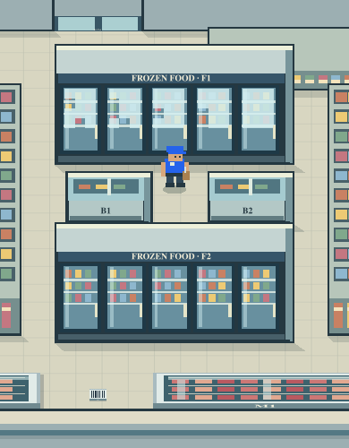

# Game 2.0: F1 field slice

## Play

Open `/game`, create or select your existing technician, and choose **F1 field practice** in Hillcrest's header. Walk to the F1 work order using the existing Walk control, floor clicks/taps, or WASD/arrow keys. Practice uses the Full Supermarket map, supplies any missing instruments as temporary dispatch loaners, dispatches only F1, and awards no career hours/XP. Career Full Supermarket also dispatches F1 first; later calls keep the existing dispatch pool.

Pick the spot on the case you want to work at, then pick what to do there. Each action names the tool it takes and reaches for it, so there is no separate tool to arm first, and a **Next** line above the actions says what the call still needs. Findings are written into the service notebook as you make them; the notebook is for reading back, and the written report at the end is where you put it into words. Readings are timestamped snapshots, including repeated product measurements so pull-down can be compared. There is no live fault-reading table.

The meter keeps the one decision that matters — the function. Choosing V, Ω or A~ places the leads on that measurement's labelled test points, and ohms on a live circuit is still the mistake it teaches.

### Suggested evaluation route

1. Evaporator → inspect the coil.
2. Controller → read the history/nameplate, then request a manual defrost.
3. Defrost circuit → remove the service cover, clamp the heater feeder, read A~ for roughly 5.8 A.
4. Wait/watch the coil, then inspect the evaporator again: two sections clear, the return section still iced.
5. Defrost circuit → secure the heater disconnect OFF, prove the circuit dead on V.
6. Disconnect one lead per element, then ohm H1/H2/H3 on Ω — 19.1 Ω, 18.8 Ω and OL — plus the frame tests if you want them.
7. Diagnose: Defrost → Electric heaters → Heater #3 open.
8. Replace heater 3 only, then reconnect, secure covers and restore.
9. Controller → request another defrost. Remove the service cover, clamp for roughly 8.7 A while energised.
10. Inspect the cleared coil, and read the controller after temperature termination.
11. Allow pull-down, probe the product for a reading at or below −8 °F, secure the service cover.
12. Report: the checklist shows what verification still needs; confirm it, build the service note from the chips or type it, and close. The debrief is also in the existing shift report.

## Integration boundaries

- `lib/game/inspection/types.ts`: serializable evidence, measurements, tool interactions and visual state.
- `f1.ts`: dispatch, inspection areas, measurement definitions and references to `defrost_heater_open` in the existing catalogue.
- `inspection/engine.ts`: physical prerequisites, action costs, frost/temperature evolution, diagnosis and verification gates.
- Existing `shiftReducer`: atomic `INSPECT` actions and the existing clock, dispatch, shrink, complaints and score path. State belongs to each `ActiveCall`, surviving UI closure/reopening.
- `inspection/engine.ts` exports `diagnoseChecklist`, `verifyChecklist` and `nextStep`. `canDiagnose`/`canVerify` are derived from those lists, so what the technician is shown cannot drift from what is enforced.
- `EquipmentInspection`, `EquipmentScene`, `EvidenceNotebook`, `DiagnosisTree`, `ToolInteraction`, `ServiceDebrief`: separate interaction and presentation modules.
- Existing `InstrumentPanel` exports the physical sampling surface; its guided legacy meter/PT benches remain available unchanged.
- `PixelEquipment`: reusable transparent SVG sprites on integer grids with `crispEdges`. Frozen sections/frost, compressor, vessels, electrical panel, fan, shelving, wall, checkout, produce, case/walk-in/RTU and player pieces are rendered in the actual StoreMap. No raster downloads, external asset paths or giant background. Existing navigation geometry is untouched.
- Only Full Supermarket selects the new art, and only F1/`defrost_heater_open` selects inspection. Other calls and maps keep `CallPanel`. Classroom/HandsOnPanel and character/progression serialization are unchanged.

## Validation

```
npm ci
npm test
npm run lint
npm run typecheck
npm run build
npx playwright install chromium
npm run test:e2e
```

Browser tests cover desktop and touch-phone full repair paths, notebook reopening, report, no horizontal overflow/runtime errors, and practice not changing saved progression. They stub the progress API and use a local fixture only. An existing Chromium can be selected with `CHROMIUM_EXECUTABLE_PATH`.

Reducer tests cover electrical prerequisites, tools/functions/leads, wrong parts and checks, failsafe vs temperature termination, evidence history, dispatch isolation, pathfinding and full completion/scoring, plus call-count shift pacing and the checklist/gate equivalence.

## Shift pacing

Corner Gas Station and Full Supermarket end on a **work list** rather than a clock: five and ten closed calls respectively (`LevelDef.callTarget`). Dispatch feeds the board on demand up to `maxOpen`, spaced by `dispatchGapMin`, and stops once the list has been handed out — so a shift always ends with nothing left open. The clock still runs and still drives shrink and complaints; it just no longer cuts the shift off. The deeper stores are unchanged and still run `shiftLenMin` against the fixed `spawnAt` schedule.

## Deliberate limits

- This is now three physical fault workflows: F1 defrost, M1 evaporator fan and the Rack A liquid line drier. What differs between them — ticket, report, work areas, measurements, parts, diagnosis vocabulary, look-at labels and the efficient path — lives in `lib/game/inspection/defs.ts`, so the panel, the scene, the diagnosis tree and the debrief no longer know which work order they are showing. What they *do* differs enough that each keeps its own module (`f1.ts`, `f2.ts`) for its physics, findings, checklists and guidance; the engine delegates to it on `InspectionState.definition`. Shared mechanics (waiting, covers, isolation, prove-dead, lead separation, restore, evidence recording, scoring) stay in one place.
- Thermal response, accumulated product-at-risk dollars and elapsed actions are teaching approximations, not a refrigeration or food-disposition model. Exposure is softened to one quarter of the original fault's shrink rate for this slice.
- Original reference element resistances and aggregate current are retained. They are not a validated voltage/topology model; do not infer supply voltage from these training values. Frame OL is a DMM continuity screen, not an insulation certification.
- A manual defrost runs until the technician ends it, so a long set of readings is never cut short. The one thing that ends it by itself is the termination thermostat seeing a clear coil, which only happens once the dead element is replaced — so before repair it waits for you, and after repair it terminates on temperature. Ending one by hand is never treated as a temperature termination. That behavior does not imply the termination device failed.
- Service covers and element-lead isolation are represented as discrete actions; terminal placement uses accessible touch/mouse controls rather than freehand cable dragging.
- Active shifts automatically checkpoint in the same browser, scoped to the signed-in account (or local play). Reload restores calls, evidence, repair state, draft reports and the clock; no time passes while away. The map returns to its spawn and instrument panels reopen from the work order. Career progress still syncs to the account; active shifts do not sync between devices. Ending a shift clears its checkpoint.
- Customers/employees and directional player animation are not part of this first equipment interaction slice.

## The evaporator-fan call (M1)

The meat multideck runs warm at one end. Three fans, one motor open: the air curtain dies over the last third, the coil under it ices heavily because nothing is pulling heat through it, and the fan circuit clamps at 0.8 A against a 1.2 A three-motor nameplate. Ohming the windings on a dead, separated circuit reads 182 Ω, 179 Ω and OL. The repair is that one motor; verification is full circuit current, even discharge air the length of the case, the heavy frost gone and the product back at or below 34 °F.

The traps are the ones that cost money in the field: clamping the circuit while it is locked out reads zero and proves nothing (filed separately so it cannot stand in for the real reading), a visual TXV check is logged as an unnecessary check, and fitting all three motors instead of the one that failed bills $285 against a $95 job. Resistance on a live circuit is refused and logged as a safety mistake, as on the defrost call.

There is no defrost in this call, so the controller offers no manual defrost and the coil strip never glows; the stopped fan is drawn stopped instead. Air recovers fastest after the repair, then the coil sheds its slab, then the product — about three ten-minute waits in total.

`M1 field practice` on the store header opens it directly; on a full supermarket shift it is the second work order dispatched, after F1.

## The liquid line drier call (Rack A)

The first call worked at the machine room rather than a case, and the first whose discriminating evidence is a pressure/temperature pair rather than a current reading. Medium-temp cases are drifting warm and the tech before you added refrigerant twice.

The reasoning the call is built around:

| Reading | Says |
|---|---|
| 224 psig liquid, 83 °F line → **11 °F subcooling** | The rack is *not* short of refrigerant. This is what rules out a third top-up. |
| 83 °F in, 66 °F out → **17 °F across the drier** | Pressure being lost in the core. A drier should show almost none. |
| 38 psig suction, 43 °F line → **28 °F superheat** | Every valve downstream is being fed flash gas. |

Fit the cores and the same three readings come back 11 °F, 1 °F and 9 °F.

**Pressure/temperature pairs are ground truth here, not flavour.** Every pairing the call quotes was computed from an equation of state (CoolProp, R-448A by mass fraction) and cross-checked against the verified table in CLAUDE.md before use. `saturationF()` holds only checked pairs and returns `null` for anything else rather than interpolating, so no reading can quote a pairing nobody verified; a reducer test pins the pairs and asserts the refusal.

The manifold is the panel's third instrument. Its mode buttons are the two ports rather than meter functions, because on a gauge set that is the decision that matters. A gauge reading returns the pressure *and* its saturation temperature, since that is what a set with a PT chart is for; the technician still pairs it with a line temperature to get subcooling or superheat.

Safety has the same shape as the electrical calls with different words: isolate → prove it is safe → open it up becomes front-seat and pump down → confirm 0 psig → change the cores. That gate covers only the work that breaks into the liquid line — weighing in refrigerant does not need it, which is how this rack got two top-ups it did not need.

### Dew vs bubble

The call reads suction against the dew point and liquid against the bubble point, which on a glide refrigerant is the difference between a right answer and one that is out by the whole glide. That was implicit in the code and invisible to the player, so it is now taught in two places from one source:

- `lib/game/glide-slides.ts` holds the content; `components/game/PtGlideSlides.tsx` pages it. The deck opens from the rack call itself, beside the gauge, and again at the classroom PT station.
- The classroom `pt` lesson gained two sections and two quiz questions, and lost a line that said R-448A simply tracks R-404A — true on pressure, misleading on saturation temperature, and exactly the habit the material exists to break.

R-448A glides 11.2 °F at 38 psig and 9.3 °F at 224 psig, both computed rather than recalled. Read a 43 °F suction line against bubble instead of dew and 28 °F of superheat reads as 39.5 °F; read an 83 °F liquid line against dew instead of bubble and 11 °F of subcooling reads as 20 °F. Both errors are the size of the glide and point opposite ways, which is how a rack collects top-ups it does not need. A test pins the slide numbers to the values `saturationF()` actually returns, so the teaching and the gameplay cannot drift apart.

Quiz pass marks became proportional (three quarters, rounded up, minimum one) when the PT lesson went from four questions to six. Every existing four-question station still needs 3, and a hands-on station's empty quiz stays unpassable through the quiz path.

`Rack field practice` on the store header opens it directly; on a full supermarket shift it is the third hands-on work order.

Next conversion: nothing is blocked. The three calls between them now cover a visual find, an electrical measurement and a P/T calculation, so the next one is a question of which fault teaches something the other three do not.

## Progression and practice corrections

- F1 practice shows one assigned call and ends automatically on completion, with no career credit.
- Call-count shifts award hours in proportion to calls completed. Timed shifts prorate by elapsed time, provided at least one call was completed. An empty shift awards no hours, XP or shift record.
- Grades include the whole assignment, including calls not yet dispatched when leaving early.
- Best grade and best total score are tracked independently; a higher score cannot lower a previous grade.

## Phone-first oblique aisle

The supermarket now uses a parallel oblique floor projection (north/south depth
at 68%, horizontal aisles retained) with upright equipment faces. F1/F2 face
south with five glass doors; the lower bunkers sit between them. Collision and
pathfinding still use floor coordinates; taps are unprojected before navigation.
All supermarket work positions remain reachable.

Solids and the technician draw in floor-depth order, allowing equipment to
occlude someone walking behind it. Foreground boundary walls are cut away.
Town, gas station and other stores retain their existing rendering. The rest of
the supermarket equipment still uses the existing sprites while the frozen
section and walk-ins establish the new visual direction.

Phone follow view targets a 320-unit scene width, with a 44-pixel-high overview
button. F1 has a large labelled tap target and a keyboard-accessible action.
Overview and follow switch without changing technician position or navigation.



This preview renders the actual scene components at a portrait crop; it is not a
browser screenshot. Automated tests cover projection round-trips, depth ordering
and reachability. Browser tests also exercise the overview toggle in the F1 flow.
